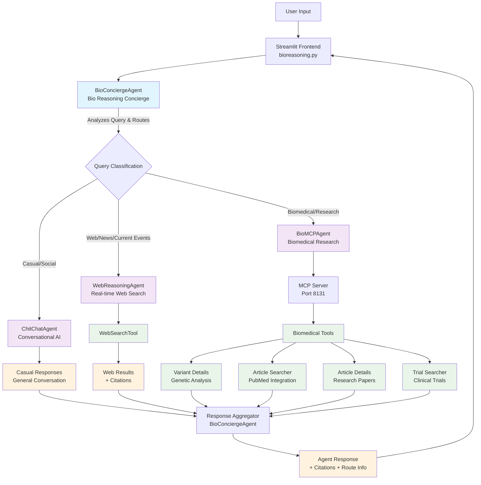

# Bio Reasoning Project

> Theodore Mui <theodoremui@gmail.com>
>
> July 12, 2025 4:13:28 PM

A comprehensive biomedical reasoning agent system that intelligently routes queries to specialized sub-agents for optimal response quality. The system combines conversational AI, real-time web search, and biomedical research capabilities through a unified interface.

## Table of Contents
- [Overview](#overview)
- [Architecture](#architecture)
- [Agent Components](#agent-components)
- [Environment Setup](#environment-setup)
- [Running the Application](#running-the-application)
- [Usage Examples](#usage-examples)
- [Configuration](#configuration)
- [Development](#development)

## Overview

The Bio Reasoning Project implements an intelligent agent orchestration system designed for biomedical research and general knowledge queries. The core **BioConciergeAgent** acts as a smart router that analyzes incoming queries and delegates them to the most appropriate specialized sub-agent.

### Key Features
- **Intelligent Query Routing**: Automatically determines the best sub-agent for each query
- **Multi-Modal Expertise**: Handles biomedical research, web search, and conversational queries
- **Citation Support**: Provides source citations for research and web-based responses
- **Streamlit Interface**: User-friendly web interface for interaction
- **Model Selection**: Support for multiple OpenAI models (GPT-4o, GPT-4.1 variants)

## Architecture

The system follows a hierarchical agent architecture with intelligent routing:



## Agent Components

### BioConciergeAgent (Primary Orchestrator)
The central intelligence that:
- Analyzes incoming user queries to understand intent and domain
- Routes queries to the most appropriate specialized sub-agent
- Aggregates responses and formats them for the user
- Handles handoffs between agents using OpenAI's Agent framework

### Sub-Agents

#### 1. ChitChatAgent
**Purpose**: Handles casual conversation and general social interactions
- **Use Cases**: Greetings, small talk, non-technical questions
- **Capabilities**: Conversational AI for human-like interactions
- **Response Format**: Prefixed with "Chit Chat Agent: "

#### 2. WebReasoningAgent  
**Purpose**: Provides real-time web search and current information
- **Use Cases**: News, current events, general web search, latest information
- **Capabilities**: 
  - Real-time web search using WebSearchTool
  - Citation extraction and formatting
  - Current date awareness for temporal queries
- **Response Format**: Prefixed with "Web Reasoning Agent: "

#### 3. BioMCPAgent
**Purpose**: Specialized biomedical research and data analysis
- **Use Cases**: 
  - Genetic variant analysis
  - PubMed article research
  - Clinical trial searches
  - Biomedical data queries
- **Capabilities**:
  - **Variant Analysis**: Detailed genetic variant information
  - **Literature Search**: PubMed article discovery and analysis
  - **Clinical Trials**: Trial search with advanced filtering
  - **Article Details**: Full research paper analysis
- **Infrastructure**: Runs dedicated MCP server on port 8131
- **Response Format**: Prefixed with "Bio MCP Agent: "

## Environment Setup

Before running the application, you need to set up the Python environment and dependencies:

### 1. Install Dependencies
```bash
uv sync
```

### 2. Activate Virtual Environment
```bash
# On Unix/macOS
source .venv/bin/activate

# On Windows
.venv\Scripts\activate
```

### 3. Set Python Path
To run the `bioagents` module, set the PYTHONPATH environment variable:

```bash
# On Unix/macOS
export PYTHONPATH="$(pwd)"

# On Windows
set PYTHONPATH=%cd%
```

### 4. Configure API Keys
Create a `.env` file in the project root with your OpenAI API key:
```bash
OPENAI_API_KEY=your_openai_api_key_here
```

## Running the Application

### Method 1: Using Streamlit Directly
After activating the virtual environment and setting the PYTHONPATH:

```bash
streamlit run bioreasoning.py
```

### Method 2: Using the Run Script (Unix/macOS)
The provided script handles environment activation and dependency checking:

```bash
./run.sh
```

### Method 3: Using VS Code Debugger
A launch configuration is provided for debugging:
1. Open the project in VS Code
2. Go to Run and Debug (Ctrl+Shift+D)
3. Select "streamlit" configuration
4. Press F5 to start debugging

### Accessing the Application
Once started, the Streamlit application will be available at:
- **Local URL**: http://localhost:8501
- The browser should automatically open to the application

## Usage Examples

### Biomedical Research Queries
```
"Find recent articles about CRISPR gene editing in cancer treatment"
"Get details for genetic variant rs113488022"
"Search for clinical trials related to Alzheimer's disease"
"What is the latest research on mRNA vaccines?"
```

### Web Search Queries  
```
"What's the latest news in artificial intelligence?"
"Current weather in Tokyo"
"Recent developments in renewable energy"
"What happened in the stock market today?"
```

### Conversational Queries
```
"Hello, how are you?"
"What can you help me with?"
"Tell me a joke"
"Good morning!"
```

## Configuration

### Model Selection
The application supports multiple OpenAI models:
- **GPT-4.1 Mini** (default) - Balanced performance and cost
- **GPT-4.1 Nano** - Fastest responses
- **GPT-4.1** - Higher capability
- **GPT-4o** - Most advanced

You can change the model using the sidebar in the Streamlit interface.

### BioMCP Server Configuration
The biomedical agent uses a dedicated MCP server:
- **Default Port**: 8131
- **Environment Variable**: `BIOMCP_PORT` (optional override)
- **Auto-Start**: The server starts automatically when needed
- **Timeout**: 60 seconds default (configurable for complex queries)

### Agent Timeouts
Each agent has configurable timeouts:
- **Default**: 60 seconds
- **BioMCP Agent**: 90 seconds (for complex biomedical queries)
- **Configurable**: Can be adjusted per agent type

## Development

### Project Structure
```
bioreasoning/
├── bioagents/              # Core agent library
│   ├── agents/            # Agent implementations
│   │   ├── bio_concierge.py   # Main orchestrator
│   │   ├── biomcp_agent.py    # Biomedical research agent
│   │   ├── web_agent.py       # Web search agent  
│   │   ├── chitchat_agent.py  # Conversational agent
│   │   └── base_agent.py      # Abstract base class
│   ├── mcp/               # MCP server implementation
│   │   └── biomcp_server.py   # Biomedical MCP server
│   └── models/            # Data models and LLM interface
├── bioreasoning.py        # Streamlit frontend application
├── pyproject.toml         # Dependencies and project config
└── run.sh                # Convenience startup script
```

### Key Dependencies
- **streamlit**: Web interface framework
- **openai**: OpenAI API client and agents framework
- **biomcp-python**: Biomedical research tools
- **loguru**: Structured logging
- **python-dotenv**: Environment variable management

### Adding New Agents
To add a new specialized agent:
1. Create a new agent class inheriting from `ReasoningAgent`
2. Implement the required methods and tools
3. Add the agent to `BioConciergeAgent._create_agent()`
4. Update the handoff descriptions for proper routing

### Testing Individual Agents
Each agent can be tested independently:
```bash
# Test the Bio Concierge Agent
python -m bioagents.agents.bio_concierge

# Test the BioMCP Agent
python -m bioagents.agents.biomcp_agent

# Test the Web Reasoning Agent  
python -m bioagents.agents.web_agent
```

### Running Tests

The project uses **pytest** for both unit and integration testing. The test suite covers all major modules, including the BioConciergeAgent, sub-agents, and core utilities.

#### 1. Environment Setup
- Ensure you have installed all dependencies and activated your virtual environment (see [Environment Setup](#environment-setup)).
- Create a `.env` file in the project root with your OpenAI API key:
  ```bash
  OPENAI_API_KEY=your_openai_api_key_here
  ```
- The test suite uses [`python-dotenv`](https://pypi.org/project/python-dotenv/) to automatically load environment variables from `.env`.

#### 2. Running All Tests
From the project root, run:
```bash
pytest
```
This will discover and run all tests in the `tests/` directory, including both unit and integration tests.

#### 3. Running Specific Tests
To run a specific test file or class:
```bash
pytest tests/agents/test_bio_concierge.py
```
Or to run a specific test function:
```bash
pytest tests/agents/test_bio_concierge.py::test_achat_chit_chat_agent_response
```

#### 4. Notes
- **Integration tests** (e.g., for `BioConciergeAgent`) require a valid OpenAI API key and internet access.
- **Unit tests** for core logic do not require external API calls.
- If you encounter API quota or network errors, you can skip integration tests by using the `-k` flag to select only unit tests.
- All test results will be shown in the terminal with detailed output for failures.

---

**Contact**: Theodore Mui <theodoremui@gmail.com>

For questions, issues, or contributions, please reach out via email.
