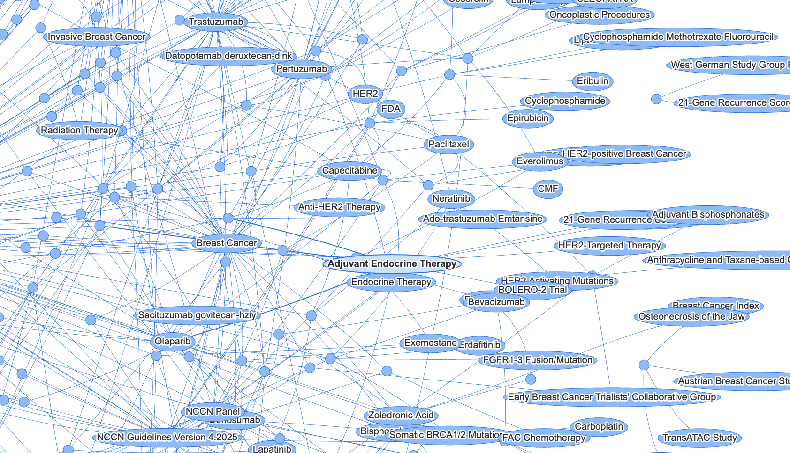
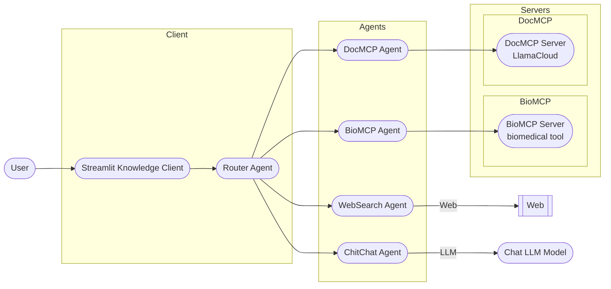
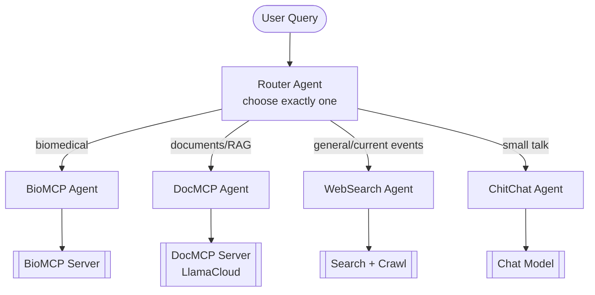
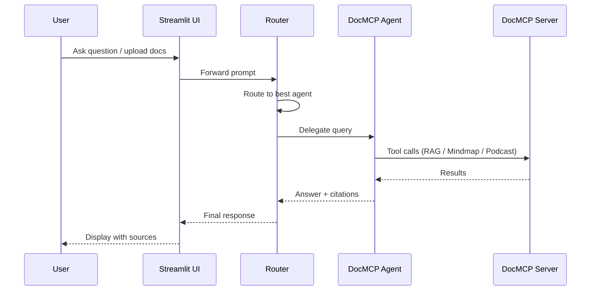
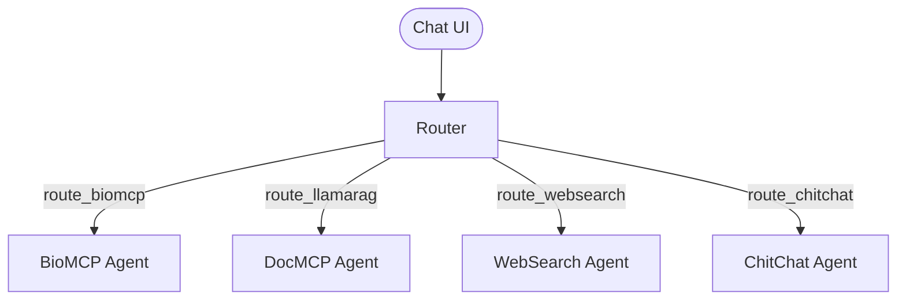

# Bio Reasoning Project

> Theodore Mui <theodoremui@gmail.com>
>
> July 20, 2025 11:00:00 PM

A comprehensive biomedical reasoning agent system that intelligently routes queries to specialized sub-agents for optimal response quality. The system combines conversational AI, real-time web search, biomedical research, document processing, mindmap creation, and podcast generation through a unified interface.

---

## Table of Contents
- [Overview](#overview)
- [Knowledge Graph Visualization](#knowledge-graph-visualization)
- [System Architecture](#system-architecture)
- [Installation](#installation)
- [Running the System](#running-the-system)
- [FastAPI Server](#fastapi-server)
- [Feature Walkthrough](#feature-walkthrough)
- [Troubleshooting](#troubleshooting)
- [Development & Advanced Usage](#development--advanced-usage)
- [Documentation](#documentation)

---

## Overview

The Bio Reasoning Project implements an intelligent agent orchestration system designed for biomedical research, document analysis, and general knowledge queries. The core **BioRouterAgent** (router-based agent) analyzes incoming queries and delegates them to the most appropriate specialized sub-agent or processing pipeline.

### Key Features
- **Intelligent Query Routing**: Automatically determines the best sub-agent for each query
- **Document Upload & Processing**: Upload PDFs, DOCX, TXT, and more for instant analysis
- **Mindmap Generation**: Visualize document structure and key concepts
- **Podcast Generation**: Create custom audio conversations from document content
- **Multi-Modal Expertise**: Handles biomedical research, web search, and conversational queries
- **Citation Support**: Provides source citations for research and web-based responses
- **Streamlit Interface**: User-friendly web interface for interaction
- **Model Selection**: Support for multiple OpenAI models (GPT-4o, GPT-4.1 variants)

---

## Knowledge Graph Visualization

The system includes a Neo4j-based Knowledge Graph that provides interactive visualization of biomedical knowledge and document relationships. The Knowledge Graph is stored in the local Neo4j database and was originally designed to showcase the NCCN Breast Cancer Guidelines knowledge structure.

**Interactive Visualization**: [Open Knowledge Graph Visualization](docs/neovis.html) (needs to render html)


**Note**: This visualization requires a running Neo4j instance with the NCCN database. The graph shows relationships between medical concepts, guidelines, and clinical recommendations extracted from the NCCN Breast Cancer Guidelines document.


---

## System Architecture

The system is composed of three main components:
- **BioMCP Server**: Biomedical tools and research endpoints (variants, PubMed, biomedical datasets)
- **DocMCP Server**: Document-centric tools backed by a LlamaCloud index (RAG, mindmaps, podcast generation)
- **Knowledge Client (Streamlit)**: User-facing web interface for uploads, queries, and results



### Routing overview


### Request sequence (typical)


---

## Installation

### Prerequisites
- Python 3.10+
- [uv](https://github.com/astral-sh/uv) (for dependency management)
- [Docker](https://docs.docker.com/get-docker/) and [Docker Compose](https://docs.docker.com/compose/install/) (for infrastructure services)
- Unix/macOS or WSL (for bash scripts)

### Step-by-Step Setup

1. **Clone the repository**
```bash
git clone <your-repo-url>
cd bioreasoning
```

2. **Start the required infrastructure services**
   
   The BioReasoning system requires several infrastructure services for observability, tracing, and data storage. These are provided via Docker Compose:
   
   **Option A: Use the startup script (Recommended)**
   ```bash
   # Unix/macOS/Linux
   ./scripts/start-infrastructure.sh
   
   # Windows PowerShell
   .\scripts\start-infrastructure.ps1
   ```
   
   **Option B: Manual Docker Compose**
   ```bash
   # Start all required services (PostgreSQL, Jaeger, OpenTelemetry Collector)
   docker-compose up -d
   
   # Verify services are running
   docker-compose ps
   ```
   
   **Services started:**
   - **PostgreSQL** (port 5432): Database for storing document metadata and traces
   - **Jaeger** (port 16686): Distributed tracing UI for debugging and monitoring
   - **OpenTelemetry Collector** (ports 4317, 4318): Telemetry data collection
   - **Adminer** (port 8080): Database administration interface
   
   **Access the services:**
   - Jaeger UI: http://localhost:16686
   - Adminer (Database): http://localhost:8080
   - PostgreSQL: localhost:5432

3. **Install dependencies**
```bash
uv sync
```

4. **Create and activate a virtual environment**
```bash
python -m venv .venv
source .venv/bin/activate  # On Windows: .venv\Scripts\activate
```

5. **Set up environment variables**
   
   **Option A: Use the setup script (Recommended)**
   ```bash
   ./scripts/setup-env.sh
   ```
   
   **Option B: Manual setup**
   - Create a `.env` file in the project root:
     **Option A: Use the setup script (Recommended)**
     ```bash
     # Unix/macOS/Linux
     ./scripts/setup-env.sh
     
     # Windows PowerShell
     .\scripts\setup-env.ps1
     ```
     
     **Option B: Manual .env file creation**
     
     Create a `.env` file in the project root with your API keys:
     
     ```bash
     # Required API Keys
     OPENAI_API_KEY=your_openai_api_key_here
     ELEVENLABS_API_KEY=your_elevenlabs_api_key_here  # Required for podcast generation
     
     # Database Configuration (matches Docker Compose defaults)
     pgql_user=llama
     pgql_psw=Salesforce1
     pgql_db=notebookllama
     
     # Observability Configuration
     OTLP_ENDPOINT=http://localhost:4318/v1/traces
     ENABLE_OBSERVABILITY=true
     ```

---

## Running the System

### 1) Start both MCP servers

- BioMCP (biomedical tools):
```bash
./scripts/run-server-biomcp.sh
```

- DocMCP (LlamaCloud index / documents):
```bash
./scripts/run-server-docs.sh
```

Environment variables (optional overrides):
- `BIOMCP_SERVER_URL` (default: `http://localhost:8132/mcp/`)
- `DOCMCP_SERVER_URL` (default: `http://localhost:8130/mcp/`)

### 2) Start the Knowledge Client (Streamlit)
```bash
./scripts/run-client.sh
```
- Runs the Streamlit app (`frontend/app.py`)
- Opens the chat interface at `http://localhost:8501`

> Ensure both servers and the client are running for full functionality.

## FastAPI Server

The project includes a modular FastAPI server that exposes the agents via simple HTTP endpoints. It mirrors the Streamlit chat functionality for programmatic access and integrations.

### Quick start
```bash
# Option A: Python module
python -m server.run

# Option B: Uvicorn
uvicorn server.api:create_app --host 0.0.0.0 --port 9000
```

The server exposes:
- `GET /health` → `{ "status": "ok" }`
- `POST /{agent_name}/chat` → JSON chat API

Example:
```bash
curl -s \
  -X POST http://localhost:9000/router/chat \
  -H 'Content-Type: application/json' \
  -d '{"query": "hello"}' | jq
```

### Configuration
- Environment variables in project root `.env` (loaded automatically):
  - `SERVER_HOST` (default `0.0.0.0`)
  - `SERVER_PORT` (default `8228`)
  - `SERVER_LOG_LEVEL` (default `info`)
  - `SERVER_CONFIG_PATH` (optional explicit YAML path)
- YAML file at project root `config/server.yaml` (auto-detected):
```yaml
server:
  host: 0.0.0.0
  port: 8228
  log_level: info

# Optional agent overrides; map key to "module:Class"
agents:
  # custom_graph: bioagents.agents.graph_agent:GraphAgent
```

Agent names supported out-of-the-box: `halo`, `router`, `graph`, `llamamcp`, `llamarag`, `web`. You can add/override via the YAML `agents:` section.

### API schema
Request body:
```json
{ "query": "your prompt" }
```
Response body:
```json
{
  "response": "...",
  "citations": [{"title": "...", "url": "...", "score": 0.0 }],
  "judgement": "...",
  "route": "graph|biomcp|chitchat|llamarag|llamamcp|websearch|reasoning"
}
```

See the detailed guide: [docs/server_api.md](docs/server_api.md)

### 3) Quick smoke tests (CLI)
- BioMCP Agent smoke test:
```bash
python -m bioagents.agents.biomcp_agent
```
- Router demo:
```bash
python -m bioagents.agents.bio_router
```

> These scripts log tool discovery and basic connectivity.

## MCP Servers

- **BioMCP Server**: exposes biomedical tools (variants, PubMed, biomedical data)
  - URL: `BIOMCP_SERVER_URL` (default `http://localhost:8132/mcp/`)
  - Scripts: `scripts/run-server-biomcp.sh`

- **DocMCP Server**: exposes document tools backed by LlamaCloud index
  - URL: `DOCMCP_SERVER_URL` (default `http://localhost:8130/mcp/`)
  - Scripts: `scripts/run-server-docs.sh`

Both servers speak the MCP streamable HTTP protocol consumed by the agents.

## Agents & Routing

Four agents are orchestrated by `bioagents/agents/bio_router.py`:
- **BioMCP Agent**: Talks to BioMCP server for biomedical queries
- **DocMCP Agent**: Talks to DocMCP (LlamaCloud index) for document/RAG workflows
- **WebSearch Agent**: Searches the public web for general knowledge and current events
- **ChitChat Agent**: Casual conversation fallback

The router selects exactly one route per query and delegates.

---

## Infrastructure Management

The BioReasoning system relies on several infrastructure services for observability, tracing, and data persistence. These services are managed through Docker Compose.

### Required Services

#### 1. **PostgreSQL Database** (Port 5432)
- **Purpose**: Stores document metadata, processing results, and trace data
- **Default Credentials**: 
  - Username: `llama`
  - Password: `S*********1`
  - Database: `notebookllama`
- **Access**: Direct connection at `localhost:5432` or via Adminer at `http://localhost:8080`

#### 2. **Jaeger Tracing** (Port 16686)
- **Purpose**: Distributed tracing UI for debugging and performance monitoring
- **Features**: 
  - View request traces across services
  - Analyze performance bottlenecks
  - Debug workflow execution
- **Access**: http://localhost:16686

#### 3. **OpenTelemetry Collector** (Ports 4317, 4318)
- **Purpose**: Collects and forwards telemetry data (traces, metrics, logs)
- **Endpoints**:
  - gRPC: `localhost:4317`
  - HTTP: `localhost:4318`
- **Configuration**: Automatically configured via `OTLP_ENDPOINT` environment variable

#### 4. **Adminer** (Port 8080)
- **Purpose**: Web-based database administration interface
- **Features**: Browse tables, execute SQL queries, manage data
- **Access**: http://localhost:8080

### Managing Infrastructure

#### Quick Start Scripts

For convenience, we provide startup scripts that handle all the infrastructure setup automatically:

**Unix/macOS/Linux:**
```bash
# Start all services with health checks
./scripts/start-infrastructure.sh

# Check status
./scripts/start-infrastructure.sh status

# View logs
./scripts/start-infrastructure.sh logs

# Stop services
./scripts/start-infrastructure.sh stop
```

**Windows PowerShell:**
```powershell
# Start all services with health checks
.\scripts\start-infrastructure.ps1

# Check status
.\scripts\start-infrastructure.ps1 status

# View logs
.\scripts\start-infrastructure.ps1 logs

# Stop services
.\scripts\start-infrastructure.ps1 stop
```

The scripts will:
- Check Docker and Docker Compose availability
- Detect port conflicts
- Start all required services
- Wait for services to be healthy
- Display connection information
- Show service status

**Testing Infrastructure:**
```bash
# Test all infrastructure services
python scripts/test-infrastructure.py

# Or run individual tests
python -c "from scripts.test_infrastructure import test_postgresql; test_postgresql()"
```

#### Starting Services
```bash
# Use the startup script (recommended)
./scripts/start-infrastructure.sh          # Unix/macOS/Linux
.\scripts\start-infrastructure.ps1         # Windows PowerShell

# Or manually with Docker Compose
docker-compose up -d                       # Start all services in background
docker-compose up                          # Start with logs visible
docker-compose up -d postgres jaeger       # Start specific services
```

#### Stopping Services
```bash
# Stop all services
docker-compose down

# Stop and remove volumes (⚠️ This will delete all data)
docker-compose down -v
```

#### Checking Service Status
```bash
# View running services
docker-compose ps

# Check service logs
docker-compose logs postgres
docker-compose logs jaeger

# Follow logs in real-time
docker-compose logs -f postgres
```

#### Testing Infrastructure
```bash
# Run comprehensive infrastructure tests
python scripts/test-infrastructure.py

# Test specific services
python -c "from scripts.test_infrastructure import test_postgresql; test_postgresql()"
python -c "from scripts.test_infrastructure import test_jaeger; test_jaeger()"
python -c "from scripts.test_infrastructure import test_otlp_endpoint; test_otlp_endpoint()"
```

### Environment Management
```bash
# Check environment configuration
./scripts/check-env.sh                    # Unix/macOS/Linux
.\scripts\check-env.ps1                   # Windows PowerShell

# Setup environment interactively
./scripts/setup-env.sh                    # Unix/macOS/Linux
.\scripts\setup-env.ps1                   # Windows PowerShell

# Check-only mode (no prompts)
.\scripts\setup-env.ps1 -CheckOnly        # Windows PowerShell
```

#### Troubleshooting Infrastructure

**Service won't start:**
```bash
# Check Docker is running
docker --version
docker-compose --version

# Check for port conflicts
netstat -ano | grep :5432
netstat -ano | grep :16686

# Restart services
docker-compose down
docker-compose up -d
```

**Database connection issues:**
```bash
# Test PostgreSQL connection
docker-compose exec postgres psql -U llama -d notebookllama

# Check database logs
docker-compose logs postgres

# Reset database (⚠️ Deletes all data)
docker-compose down -v
docker-compose up -d postgres
```

**Jaeger not accessible:**
```bash
# Check Jaeger is running
curl http://localhost:16686/api/services

# View Jaeger logs
docker-compose logs jaeger

# Restart Jaeger
docker-compose restart jaeger
```

### Environment Variables

The following environment variables control infrastructure behavior:

```bash
# Database Configuration
pgql_user=llama                   # PostgreSQL username
pgql_psw=S*********1              # PostgreSQL password  
pgql_db=notebookllama             # PostgreSQL database name

# Observability Configuration
OTLP_ENDPOINT=http://localhost:4318/v1/traces  # OpenTelemetry endpoint
ENABLE_OBSERVABILITY=true                      # Enable/disable observability
```

### Data Persistence

- **PostgreSQL data**: Stored in Docker volume `pgdata`
- **Jaeger data**: Stored in memory (resets on restart)
- **Application data**: Stored in `data/` directory

To backup PostgreSQL data:
```bash
# Create backup
docker-compose exec postgres pg_dump -U llama notebookllama > backup.sql

# Restore backup
docker-compose exec -T postgres psql -U llama notebookllama < backup.sql
```

---

## Feature Walkthrough

### 1. Document Upload & Processing
- Upload PDF, DOCX, TXT, or MD files via the web interface
- The system processes the document and displays:
  - **Summary**
  - **Bullet Points**
  - **FAQ** (expandable)
  - **Mindmap** (interactive HTML)

**Example:**
1. Go to the "Documents" page
2. Upload `example.pdf`
3. View the summary, bullet points, FAQ, and mindmap

### 2. Mindmap Generation
- Automatically generated for each processed document
- Visualizes document structure and key concepts

**Example:**
- After uploading a document, scroll to the "Mind Map" section to explore the visualization

### 3. Podcast Generation
- Customize style, tone, audience, and speaker roles
- Click "Generate In-Depth Conversation" to create a podcast from the document
- Listen to the generated audio directly in the browser

**Example:**
- After processing a document, expand the "Podcast Configuration" panel
- Choose "interview" style, "friendly" tone, and set speakers
- Click the button and listen to the result

### 4. Chat Orchestration & Routing
- The Streamlit chat page (`frontend/pages/1_Chat.py`) includes an Orchestrator selector in the sidebar. Options: `halo`, `router`, `graph`, `llamarag`, `llamamcp`, `biomcp`, `web`, `chitchat` (see `frontend/components/session_manager.py`).
- When `router` is selected, the Router agent uses tool choices (route_biomcp, route_llamarag, route_websearch, route_chitchat) to choose exactly one specialized sub-agent.
- When `halo` is selected, the HALO orchestrator plans capabilities, runs multiple specialists in parallel, judges their responses, and synthesizes a single answer.
- Assistant messages may include:
  - a Sources expander (citations with titles, optional pages/snippets, and scores)
  - a Judge expander (structured evaluation with overall score and per-subagent notes)



---

## Troubleshooting

### General Issues
- **Server/Client not running**: Ensure both `run-server-docs.sh` and `run-client.sh` are running in separate terminals
- **Port conflicts**: Default ports are 8501 (client) and 8131 (server); change if needed
- **Missing dependencies**: Run `uv sync` and ensure your virtual environment is activated
- **API key issues**: Check your `.env` file and ensure `OPENAI_API_KEY` is set
- **File upload issues**: Supported formats are PDF, DOCX, TXT, and MD

### Infrastructure Issues
- **Docker services not running**: Run `docker-compose up -d` to start required services
- **Database connection errors**: Check PostgreSQL is running with `docker-compose ps`
- **OpenTelemetry connection failures**: Verify Jaeger is accessible at http://localhost:16686
- **Port conflicts with infrastructure**: Check for conflicts on ports 5432, 16686, 4317, 4318, 8080

### Podcast Generation Issues
- **"Podcast generation is not available"**: 
  - Run `./scripts/setup-env.sh` to configure API keys
  - Ensure both `OPENAI_API_KEY` and `ELEVENLABS_API_KEY` are set in your `.env` file
  - Get your ElevenLabs API key from: https://elevenlabs.io/speech-synthesis

- **"Authentication failed"**: 
  - Check that your `ELEVENLABS_API_KEY` is valid and active
  - Verify your ElevenLabs account has sufficient credits

- **"API quota exceeded"**: 
  - Check your ElevenLabs account usage and limits
  - Consider upgrading your ElevenLabs plan if needed

- **Audio generation fails**: 
  - Ensure your document has sufficient content for conversation generation
  - Try with a shorter document or different content

### Environment Variable Issues
- **"export: not a valid identifier" errors**: 
  - Run `./scripts/check-env.sh` to diagnose .env file issues
  - The script now properly handles multi-line values and special characters
  - Check for proper variable name formatting (no spaces around equals signs)

- **Missing or invalid API keys**: 
  - Run `./scripts/check-env.sh` to verify your configuration
  - Use `./scripts/setup-env.sh` to configure missing keys

---

## Development & Advanced Usage

### Project Structure
```text
bioreasoning/
├── bioagents/              # Core agent library
│   ├── agents/            # Agent implementations
│   ├── mcp/               # MCP server implementation
│   └── models/            # Data models and LLM interface
├── frontend/              # Streamlit frontend
│   ├── app.py             # Main entry point
│   └── pages/             # Multi-page app modules
├── scripts/
│   ├── run-server-docs.sh
│   ├── run-server-biomcp.sh
│   └── run-client.sh
├── pyproject.toml         # Dependencies and project config
└── README.md
```

### Adding New Document Processors or Features
- Add new processors to `bioagents/mcp/` and update the server logic
- Add new UI components to `frontend/pages/`
- Update the architecture diagrams in `docs/` as needed

---

## Documentation

- See the `docs/` folder for:
  - **[Infrastructure Quick Start](docs/infrastructure-quickstart.md)**: Get up and running quickly
  - **[Infrastructure Documentation](docs/infrastructure.md)**: Comprehensive infrastructure guide
  - **[Provenance & Citations](docs/knowledge_provenance.md)**: How triplet sources and citations work
  - **Architecture**: Detailed diagrams and flowcharts
  - **Processing**: Step-by-step document, mindmap, and podcast flows
  - **Troubleshooting**: Common issues and solutions

---

**Contact**: Theodore Mui <theodoremui@gmail.com>

For questions, issues, or contributions, please reach out via email.
