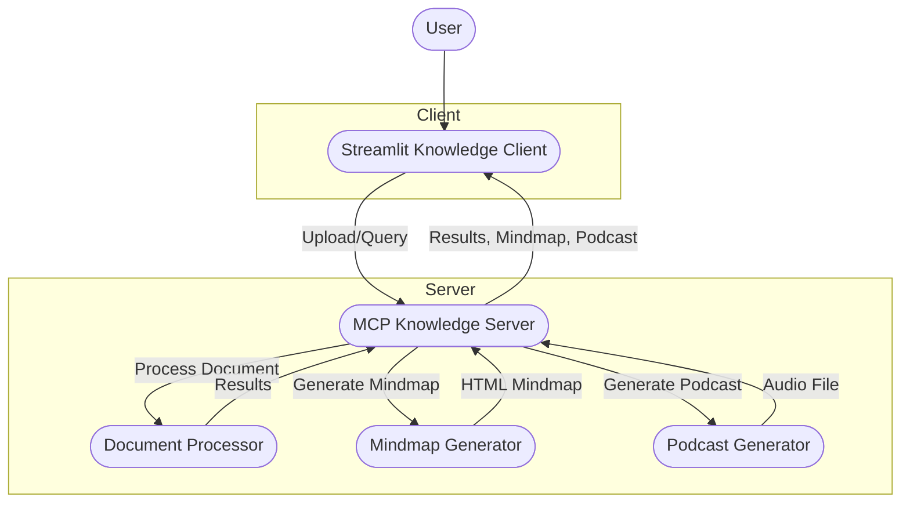
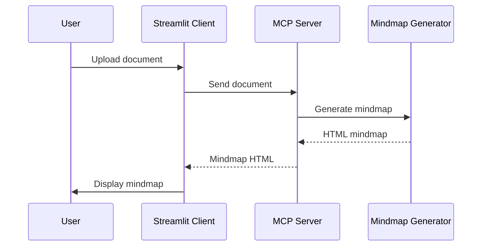
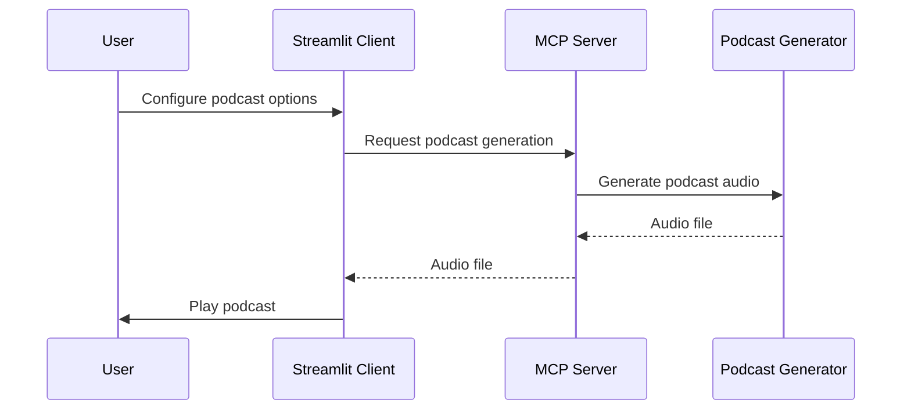

# System Architecture: BioReasoning

## High-Level Overview

The BioReasoning system is split into two main components:
- **Knowledge Client (Streamlit Web App)**: User interface for uploading documents, viewing results, and generating podcasts.
- **Knowledge Server (MCP)**: Backend server responsible for document processing, mindmap generation, and podcast creation.

## Component Diagram

## Data Flow: Document Processing

1. **User uploads a document** via the Streamlit client.
2. **Client sends the file** to the MCP server.
3. **MCP server processes the document**:
   - Extracts summary, bullet points, FAQ
   - Generates a mindmap (HTML)
   - Prepares content for podcast generation
4. **Results are sent back** to the client and displayed in the UI.

## Data Flow: Mindmap Generation

## Data Flow: Podcast Generation

## Key Design Principles
- **Separation of Concerns**: UI and processing are decoupled for scalability and maintainability.
- **Extensibility**: New document processors, mindmap types, or podcast styles can be added independently.
- **Interactive Feedback**: Users receive immediate feedback and can customize podcast generation.

---

For more details, see [processing.md](processing.md) and [troubleshooting.md](troubleshooting.md). 