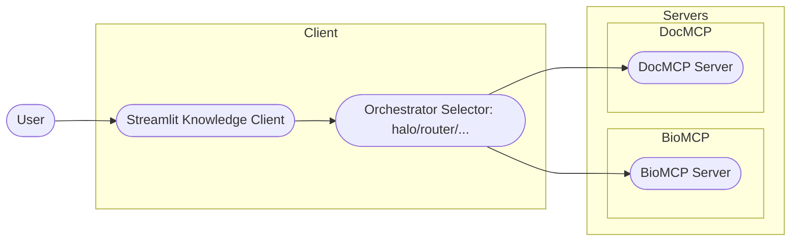
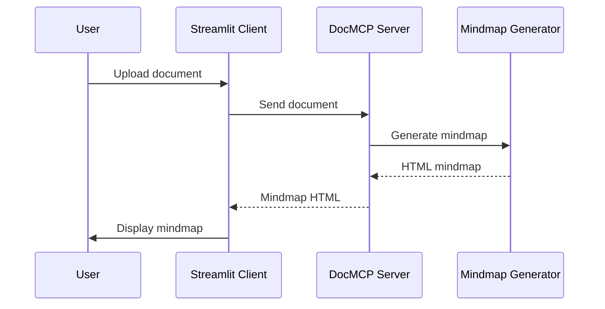
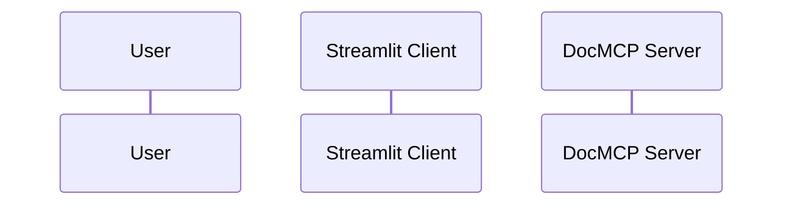
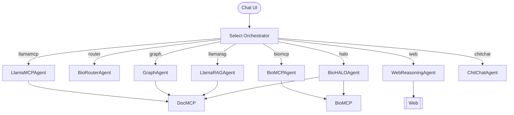

# System Architecture: BioReasoning

## High-Level Overview

The BioReasoning system consists of a Streamlit client and multiple MCP servers:
- **Knowledge Client (Streamlit Web App)**: User interface for chat, uploads, results, and podcast generation.
- **BioMCP Server**: Biomedical tools and research endpoints (variants, PubMed, biomedical datasets).
- **DocMCP Server**: Document-centric tools backed by a LlamaCloud index (RAG, mindmaps, podcast generation).

## Component Diagram



## Data Flow: Document Processing

1. **User uploads a document** via the Streamlit client.
2. **Client sends the file** to the MCP server.
3. **MCP server processes the document**:
   - Extracts summary, bullet points, FAQ
   - Generates a mindmap (HTML)
   - Prepares content for podcast generation
4. **Results are sent back** to the client and displayed in the UI.

## Data Flow: Mindmap Generation (DocMCP)



## Data Flow: Podcast Generation (DocMCP)



## Chat Orchestration

The chat page (`frontend/pages/1_Chat.py`) provides an Orchestrator selector. The `SessionManager` maps selections to agents (`BioHALOAgent`, `BioRouterAgent`, `GraphAgent`, `LlamaRAGAgent`, `LlamaMCPAgent`, `BioMCPAgent`, `WebReasoningAgent`, `ChitChatAgent`).


    participant Podcast as Podcast Generator

    User->>Client: Configure podcast options
    Client->>Server: Request podcast generation
    Server->>Podcast: Generate podcast audio
    Podcast-->>Server: Audio file
    Server-->>Client: Audio file
    Client->>User: Play podcast
```

## Key Design Principles
- **Separation of Concerns**: UI and processing are decoupled for scalability and maintainability.
- **Extensibility**: New document processors, mindmap types, or podcast styles can be added independently.
- **Interactive Feedback**: Users receive immediate feedback and can customize podcast generation.

---

For more details, see [processing.md](processing.md) and [troubleshooting.md](troubleshooting.md). 