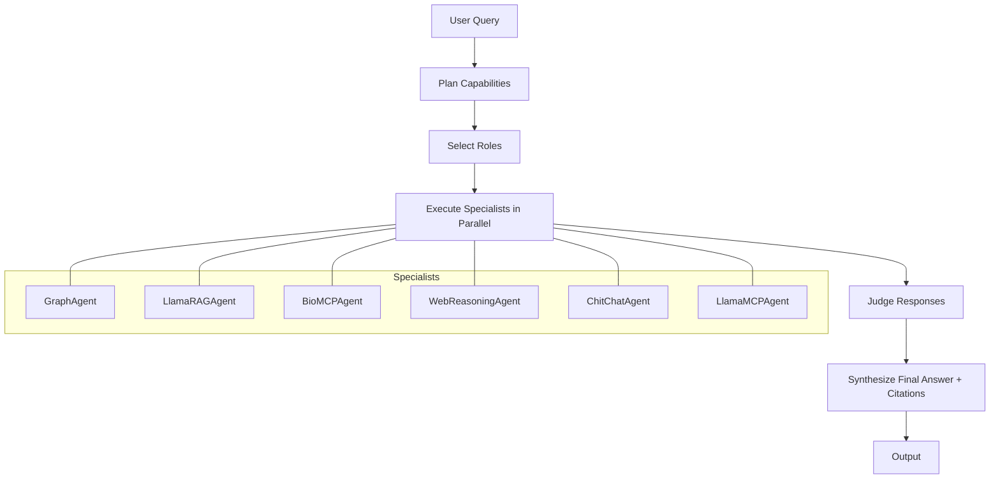

# BioHALOAgent: Hierarchical Orchestration for Multi-Agent LLM Systems

This document describes the architecture, design, and implementation of `BioHALOAgent`, a HALO-style hierarchical orchestrator that complements the router-based `BioRouterAgent`.

Reference: HALO framework – Hierarchical Autonomous Logic-Oriented Orchestration for Multi-Agent LLM Systems [arXiv:2505.13516](https://arxiv.org/abs/2505.13516).

## Goals
- Invoke any subset of specialists per query (parallel/sequential as needed)
- Provide critique via `judge_response` and synthesize a single answer
- Keep extensible: heuristics can be replaced by LLM planners/RL policies
- Follow SOLID/DRY and Occam’s Razor – clear, minimal abstractions

## Architecture



- Plan: derive capability tags (`graph`, `rag`, `biomcp`, `web`, `llama_mcp`, `chitchat`) via structured LLM planning
- Select Roles: map tags to concrete agents (lazy import for RAG)
- Execute: run all selected agents concurrently and await all results
- Judge: perform LLM-based, structured evaluation of each sub-agent output (scores 0.0–1.0 with concise justifications and prose summary)
- Synthesize: combine responses with prioritized merging and lazy inline citations that reference only sources actually used in the final text
  - Inline Citations: the final HALO response inserts numbered inline citations like `[1,2]` assigned lazily when a source first appears in the composed text, and only those sources are included in `AgentResponse.citations`

## Design Rationale
- Router-first for precise control; HALO for breadth/recall and complex queries
- Lightweight scoring upgraded to LLM-based structured judging for consistency and transparency
- Easy to upgrade: swap `_plan`, `_judge`, or `_synthesize` with LLMs/RL

### Structured LLM Planning (Pydantic-validated)
`BioHALOAgent` plans capabilities using a small LLM (`LLM.GPT_4_1_MINI`) that returns strict JSON validated by a Pydantic schema. This removes brittle keyword heuristics and keeps a minimal fallback to `["chitchat"]` on malformed outputs.

Schema and planner (excerpt):

```python
class _CapabilityPlan(BaseModel):
    capabilities: List[Literal["graph", "rag", "biomcp", "web", "llama_mcp", "chitchat"]]
```

### LLM-based Judging (Structured Output)
Each sub-agent response is evaluated by an LLM using structured output validated by Pydantic.

Schema (simplified):
```python
class AgentJudgment(BaseModel):
    prose_summary: str
    scores: Dict[str, float]  # accuracy, completeness, groundedness, professional_tone, clarity_coherence, relevance, usefulness
    overall_score: float      # 0.0–1.0
    justifications: Dict[str, str]
```

Judging prompt requires returning only JSON and uses `response_format={"type": "json_object"}` for reliability. If the LLM judging fails, a deterministic fallback computes a conservative score.

### Synthesis, Inline Citations, and Evaluation Block
- Prioritize content: graph > rag > biomcp > llama_mcp > web > chitchat
- Weave unique sentences from secondaries
- Assign inline citation indices lazily at the point of use; only used sources are retained in `AgentResponse.citations`
- Append a structured evaluation block at the end:

Example tail section:
```
Overall Score: 0.90
Assessment: Best performing agent: web (score: 0.96); Lowest performing agent: rag (score: 0.80); High-quality responses from: biomcp, rag, web
- graph: 0.88 - Strong, well-grounded summary. (with 2 sources)
- rag: 0.80 - Useful but could be more specific. (with 1 sources)
- web: 0.96 - Comprehensive and clear with strong grounding. (with 3 sources)
```

### Testing Strategy
- Unit tests for planning, selection, judging (LLM and fallback), and synthesis
- Integration tests with mocked sub-agents (async) covering:
  - Single- and multi-capability queries
  - Error handling and timeouts
  - Inline citation indexing and pruning of unused sources
  - Structured evaluation block presence and formatting

## Future Work
- Enrich judging with retrieval-backed verification
- Policy learning for cost/quality optimization

## Reference
- HALO: [https://arxiv.org/abs/2505.13516](https://arxiv.org/abs/2505.13516)
