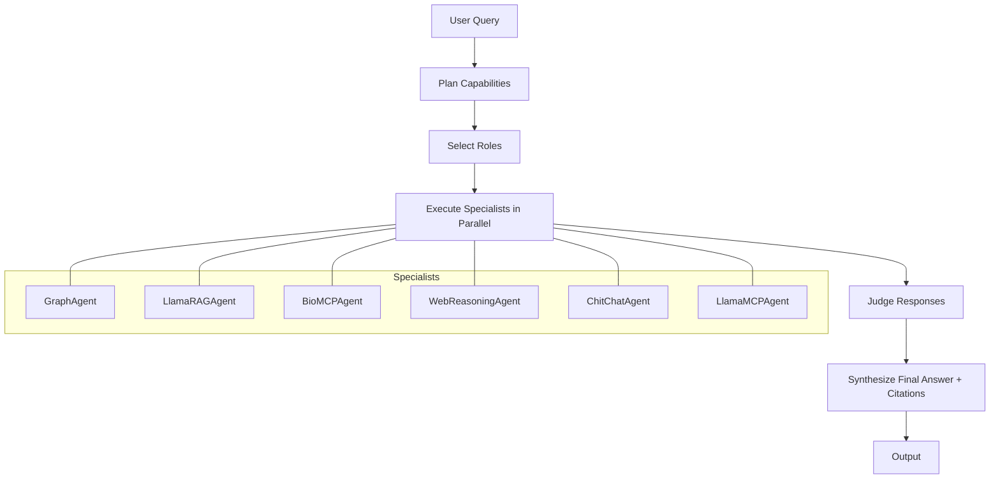

# BioHALOAgent: Hierarchical Orchestration for Multi-Agent LLM Systems

This document describes the architecture, design, and implementation of `BioHALOAgent`, a HALO-style hierarchical orchestrator that complements the router-based `BioRouterAgent`.

Reference: HALO framework – Hierarchical Autonomous Logic-Oriented Orchestration for Multi-Agent LLM Systems [arXiv:2505.13516](https://arxiv.org/abs/2505.13516).

## Goals
- Invoke any subset of specialists per query (parallel/sequential as needed)
- Provide critique via `judge_response` and synthesize a single answer
- Keep extensible: heuristics can be replaced by LLM planners/RL policies
- Follow SOLID/DRY and Occam’s Razor – clear, minimal abstractions

## Architecture



- Plan: derive capability tags (graph, rag, biomcp, web, llama_mcp, chitchat)
- Select Roles: map tags to concrete agents
- Execute: run selected agents concurrently with robust error handling
- Judge: produce a lightweight critique across sub-agent outputs
- Synthesize: prioritize authoritative content and merge citations

## Design Rationale
- Router-first for precise control; HALO for breadth/recall and complex queries
- Lightweight scoring to keep deterministic and testable
- Easy to upgrade: swap `_plan`, `_judge`, or `_synthesize` with LLMs/RL

### Structured LLM Planning
`BioHALOAgent` plans capabilities using a small LLM with strict JSON output validated by a Pydantic schema. This removes brittle keyword heuristics while keeping a minimal fallback to `["chitchat"]` on malformed outputs. The schema enforces allowed capabilities: `graph`, `rag`, `biomcp`, `web`, `llama_mcp`, `chitchat`.

## Key Interfaces (excerpt)

```python
capabilities = self._plan(query)
roles = self._select_roles(capabilities)
outputs = await self._execute_roles(query, roles)
judge_text = self._judge(outputs, query)
return self._synthesize(outputs, judge_text)
```

## Testing Strategy
- Unit tests for planning, selection, judging, and synthesis
- Integration tests with mocked sub-agents (async) covering:
  - Single-capability queries (e.g., RAG only)
  - Multi-capability queries (graph + rag + biomcp)
  - Error handling and timeouts
  - Judge summary presence and citation merging

## Future Work
- Replace heuristic planner with LLM-based planner
- Add adaptive policy for cost/quality optimization (cf. MAO-ARAG)
- Enrich judge with retrieval-backed verification

## Reference
- HALO: [https://arxiv.org/abs/2505.13516](https://arxiv.org/abs/2505.13516)
