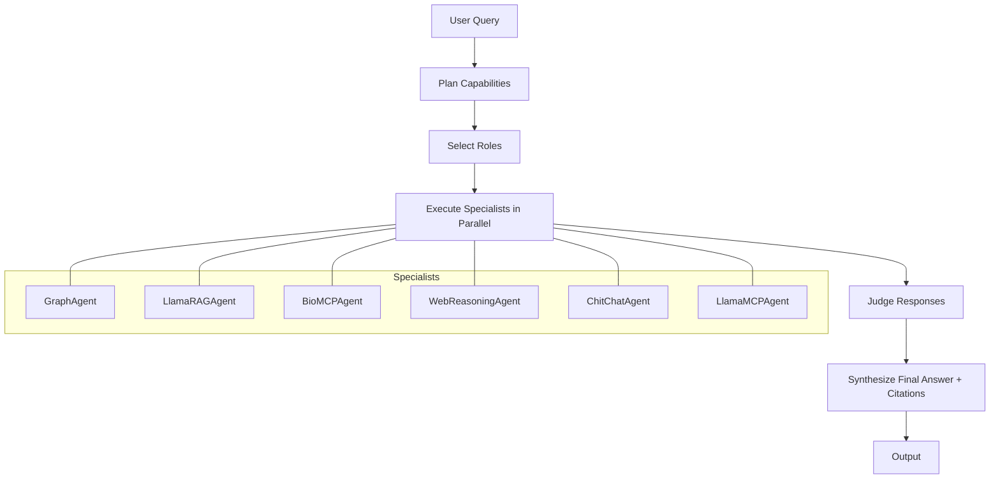

# BioHALOAgent: Hierarchical Orchestration for Multi-Agent LLM Systems

This document describes the architecture, design, and implementation of `BioHALOAgent`, a HALO-style hierarchical orchestrator that complements the router-based `BioRouterAgent`.

Reference: HALO framework – Hierarchical Autonomous Logic-Oriented Orchestration for Multi-Agent LLM Systems [arXiv:2505.13516](https://arxiv.org/abs/2505.13516).

## Goals
- Invoke any subset of specialists per query (parallel/sequential as needed)
- Provide critique via `judge_response` and synthesize a single answer
- Keep extensible: heuristics can be replaced by LLM planners/RL policies
- Follow SOLID/DRY and Occam’s Razor – clear, minimal abstractions

## Architecture



- Plan: derive capability tags (`graph`, `rag`, `biomcp`, `web`, `llama_mcp`, `chitchat`) via structured LLM planning
- Select Roles: map tags to concrete agents (lazy import for RAG)
- Execute: run all selected agents concurrently and await all results
- Judge: produce a lightweight critique (`judge_response`) across sub-agent outputs
- Synthesize: combine responses with a primary section and “Additional insights” from others; merge and de-duplicate citations
 - Inline Citations: the final HALO response inserts numbered inline citations like `[1,2]` mapped to the merged unique source list in `AgentResponse.citations`

## Design Rationale
- Router-first for precise control; HALO for breadth/recall and complex queries
- Lightweight scoring to keep deterministic and testable
- Easy to upgrade: swap `_plan`, `_judge`, or `_synthesize` with LLMs/RL

### Structured LLM Planning (Pydantic-validated)
`BioHALOAgent` plans capabilities using a small LLM (`LLM.GPT_4_1_MINI`) that returns strict JSON validated by a Pydantic schema. This removes brittle keyword heuristics and keeps a minimal fallback to `["chitchat"]` on malformed outputs.

Schema and planner (excerpt):

```111:156:bioagents/agents/bio_halo.py
class _CapabilityPlan(BaseModel):
    capabilities: List[
        Literal["graph", "rag", "biomcp", "web", "llama_mcp", "chitchat"]
    ]

async def _plan_with_llm(self, query: str) -> List[str]:
    content = await llm.achat_completion(
        prompt,
        temperature=0,
        response_format={"type": "json_object"},
    )
    data = json.loads((content or "{}").strip())
    plan = BioHALOAgent._CapabilityPlan.model_validate(data)
    # dedupe preserve order -> return or ["chitchat"]
```

Input/Output contract the LLM follows:

```json
{
  "capabilities": ["graph", "rag"]
}
```

Notes:
- If validation fails or output is not valid JSON, the planner minimally falls back to `["chitchat"]`.
- `_plan()` is a sync wrapper used by tests; in async contexts `achat()` calls `_plan_async()`.

## Key Interfaces (excerpt)

```python
capabilities = self._plan(query)
roles = self._select_roles(capabilities)
outputs = await self._execute_roles(query, roles)
judge_text = self._judge(outputs, query)
return self._synthesize(outputs, judge_text)
```

### Role Selection and Lazy Imports
RAG is an optional dependency. To avoid import-time failures, `LlamaRAGAgent` is lazily imported during `start()` and wrapped with a `try/except`. Other sub-agents are instantiated directly.

```79:95:bioagents/agents/bio_halo.py
self._graph_agent = GraphAgent(name="Graph Agent")
try:
    from bioagents.agents.llamarag_agent import LlamaRAGAgent  # type: ignore
    self._rag_agent = LlamaRAGAgent(name="LlamaCloud RAG Agent")
except Exception:
    self._rag_agent = None
self._biomcp_agent = BioMCPAgent(name="Bio MCP Agent")
self._web_agent = WebReasoningAgent(name="Web Reasoning Agent")
```

### Execute, Judge, Synthesize
- Execute: All selected sub-agents run in parallel; errors are caught per-agent and replaced with a short availability message.
- Judge: A lightweight score considers citation count, response length, and domain hints. The summary is returned in `AgentResponse.judge_response`.
- Synthesize:
  - Citations from all sub-agents are merged and de-duplicated by URL.
  - A global index is built (1..N) across unique sources.
  - Primary and supplementary text fragments get inline markers based on which sub-agent contributed the fragment (e.g., `… recommended therapy [1,3]`).
  - Agent tags like `[Graph]` or `[RAG]` are stripped for a clean prose answer.
  - If BioMCP is primary, the judge summary is appended as a final guidance note.

Example (inline markers):

```text
[HALO] NCCN recommends trastuzumab-based regimens for HER2+ disease [1,3]. Additional insights include pertuzumab in neoadjuvant settings [2].

Sources:
1) https://example.com/nccn
2) https://example.com/pertuzumab
3) https://example.com/trastuzumab
```

```216:242:bioagents/agents/bio_halo.py
results = await asyncio.gather(*tasks, return_exceptions=True)
outputs: List[Tuple[str, AgentResponse]] = []
for r in results:
    if isinstance(r, Exception):
        logger.warning(f"HALO sub-agent failed: {r}")
        continue
    outputs.append(r)
```

```269:296:bioagents/agents/bio_halo.py
for cap, resp in outputs:
    score = 0
    if resp.citations: score += min(3, len(resp.citations))
    if len(resp.response_str or "") > 120: score += 1
    # domain hints -> adjust score
final_text = "[HALO] " + (" ".join(primary_text_parts) if primary_text_parts else "No primary answer available.")
if supplementary_parts:
    final_text += "\n\nAdditional insights:" + "".join(supplementary_parts)
```

## Testing Strategy
- Unit tests for planning, selection, judging, and synthesis
- Integration tests with mocked sub-agents (async) covering:
  - Single-capability queries (e.g., RAG only)
  - Multi-capability queries (graph + rag + biomcp)
  - Error handling and timeouts
  - Judge summary presence and citation merging

### Planner Tests (examples)
- Success: mock LLM to return `{"capabilities":["graph","rag"]}` and assert order is preserved.
- Invalid JSON: mock LLM to return `not-json` and assert fallback `['chitchat']`.
- Validation failure: mock LLM to return `{"capabilities":["unknown"]}` and assert fallback `['chitchat']`.

### Override Planner for Experiments
You can override the planner in tests or experiments to force specific configurations:

```python
agent = BioHALOAgent(name="BioHALO")
agent._plan = lambda q: ["graph", "rag"]
resp = await agent.achat("HER2 and HR status interactions?")
```

## Future Work
- Replace heuristic planner with LLM-based planner
- Add adaptive policy for cost/quality optimization (cf. MAO-ARAG)
- Enrich judge with retrieval-backed verification

## Reference
- HALO: [https://arxiv.org/abs/2505.13516](https://arxiv.org/abs/2505.13516)
