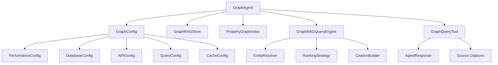

# GraphAgent Documentation

## Overview

The `GraphAgent` is a sophisticated knowledge graph agent designed to answer questions about NCCN breast cancer guidelines using GraphRAG (Graph Retrieval-Augmented Generation) technology. It provides expert-level responses with citations and provenance tracking.

## Architecture

### Design Principles

The GraphAgent follows SOLID principles and modern software engineering best practices:

- **Single Responsibility**: Each component has a focused, well-defined purpose
- **Open/Closed**: Extensible through dependency injection without modification
- **Liskov Substitution**: Implements BaseAgent interface consistently
- **Interface Segregation**: Clean, minimal interfaces for each component
- **Dependency Inversion**: Depends on abstractions, not concrete implementations

### Component Architecture



## Features

### Core Capabilities

1. **Knowledge Graph Querying**: Intelligent retrieval from NCCN breast cancer guidelines
2. **Citation Generation**: Automatic citation extraction with provenance tracking
3. **Dependency Injection**: Flexible component configuration and testing
4. **Async Lifecycle Management**: Proper resource management and cleanup
5. **Error Handling**: Robust error handling with graceful degradation
6. **Configuration Management**: Environment-based configuration with validation

### Advanced Features

1. **Multi-strategy Entity Resolution**: Identifies relevant entities from queries
2. **Community-based Ranking**: Ranks information by relevance and authority
3. **Provenance Tracking**: Maintains complete audit trail of information sources
4. **Caching Support**: Efficient caching of communities and query results
5. **Unicode Support**: Handles international characters and special symbols
6. **Concurrent Query Support**: Thread-safe query processing

## Usage

### Basic Usage

```python
from bioagents.agents.graph_agent import GraphAgent

# Simple usage with defaults
agent = GraphAgent(name="Medical Expert")

async with agent:
    response = await agent.achat("What is the recommended treatment for HER2-positive breast cancer?")
    print(response.response_str)
    
    # Access citations
    for citation in response.citations:
        print(f"Source: {citation.title} (Page {citation.start_page_label})")
```

### Advanced Usage with Dependency Injection

```python
from bioagents.agents.graph_agent import GraphAgent
from bioagents.graph import GraphConfig, GraphRAGStore, GraphRAGQueryEngine

# Custom configuration
config = GraphConfig.from_environment()
config.query.similarity_top_k = 15
config.query.max_summaries_to_use = 8

# Custom components (for testing or specialized use cases)
custom_store = GraphRAGStore(
    username="custom_user",
    password="custom_pass",
    url="bolt://custom-neo4j:7687"
)

agent = GraphAgent(
    name="Custom Medical Expert",
    config=config,
    graph_store=custom_store,
    auto_initialize=True
)

async with agent:
    response = await agent.achat("How should triple-negative breast cancer be treated?")
    print(f"Response: {response.response_str}")
    print(f"Citations: {len(response.citations)}")
```

### Manual Lifecycle Management

```python
agent = GraphAgent(name="Manual Agent", auto_initialize=False)

try:
    await agent.start()
    
    # Use agent for multiple queries
    queries = [
        "What is ICD-10?",
        "How is breast cancer staged?",
        "What are the side effects of chemotherapy?"
    ]
    
    for query in queries:
        response = await agent.achat(query)
        print(f"Q: {query}")
        print(f"A: {response.response_str[:100]}...")
        print()

finally:
    await agent.stop()
```

## Configuration

### Environment Variables

The GraphAgent uses environment-based configuration with the following variables:

#### Performance Settings
- `KG_EXTRACTION_WORKERS`: Number of workers for knowledge extraction (default: 8)
- `PDF_PARSE_WORKERS`: Number of workers for PDF parsing (default: 8)
- `MAX_PATHS_PER_CHUNK`: Maximum paths per text chunk (default: 2)
- `MAX_CLUSTER_SIZE`: Maximum cluster size for communities (default: 5)

#### Database Settings
- `NEO4J_USERNAME`: Neo4j database username (default: "neo4j")
- `NEO4J_PASSWORD`: Neo4j database password (default: "Salesforce1")
- `NEO4J_URL`: Neo4j connection URL (default: "bolt://localhost:7687")

#### API Settings
- `LLAMACLOUD_API_KEY`: LlamaCloud API key for document processing (required)
- `OPENAI_MODEL`: OpenAI model to use (default: "gpt-4.1-mini")

#### Query Settings
- `SIMILARITY_TOP_K`: Number of similar entities to retrieve (default: 20)
- `MAX_SUMMARIES_TO_USE`: Maximum community summaries to use (default: 6)
- `MAX_TRIPLETS_TO_USE`: Maximum triplets to use (default: 20)

#### Cache Settings
- `COMMUNITIES_CACHE_FILE`: Path to communities cache file (default: "data/nccn_communities.json")
- `VALIDATE_CACHE_SIGNATURE`: Whether to validate cache signatures (default: true)
- `PREFER_CACHE_WHEN_GRAPH_EMPTY`: Prefer cache when graph is empty (default: true)

### Configuration Example

```bash
# .env file
LLAMACLOUD_API_KEY=your_api_key_here
NEO4J_PASSWORD=your_neo4j_password
OPENAI_MODEL=gpt-4.1-mini
SIMILARITY_TOP_K=25
MAX_SUMMARIES_TO_USE=8
KG_EXTRACTION_WORKERS=12
```

## API Reference

### GraphAgent Class

#### Constructor

```python
def __init__(
    self,
    name: str,
    model_name: str = LLM.GPT_4_1_NANO,
    config: Optional[GraphConfig] = None,
    graph_store: Optional[GraphRAGStore] = None,
    index: Optional[PropertyGraphIndex] = None,
    query_engine: Optional[GraphRAGQueryEngine] = None,
    pdf_path: str = "data/nccn_breast_cancer.pdf",
    auto_initialize: bool = True,
)
```

**Parameters:**
- `name`: Agent name for identification
- `model_name`: LLM model to use for responses
- `config`: Graph configuration (defaults to environment-based config)
- `graph_store`: Graph storage instance (created if not provided)
- `index`: Property graph index (created if not provided)
- `query_engine`: Query engine instance (created if not provided)
- `pdf_path`: Path to PDF document for processing
- `auto_initialize`: Whether to initialize components automatically

#### Methods

##### `async def achat(query_str: str) -> AgentResponse`

Process a chat query using the knowledge graph.

**Parameters:**
- `query_str`: The user's question about breast cancer guidelines

**Returns:**
- `AgentResponse`: Response with answer and citations from knowledge graph

**Example:**
```python
response = await agent.achat("What are the NCCN guidelines for breast cancer screening?")
```

##### `async def start() -> None`

Start the graph agent and initialize all components.

##### `async def stop() -> None`

Stop the graph agent and cleanup resources.

#### Properties

- `config: GraphConfig` - Get/set the graph configuration
- `graph_store: Optional[GraphRAGStore]` - Get the graph store instance
- `index: Optional[PropertyGraphIndex]` - Get the property graph index
- `query_engine: Optional[GraphRAGQueryEngine]` - Get the query engine instance

### AgentResponse Class

```python
@dataclass
class AgentResponse:
    response_str: str
    citations: List[Source] = field(default_factory=list)
    judge_response: str = ""
    route: AgentRouteType = AgentRouteType.REASONING
```

### Source Class

```python
class Source(BaseModel):
    url: Optional[str] = ""
    title: Optional[str] = ""
    snippet: Optional[str] = ""
    source: Optional[str] = ""
    file_name: Optional[str] = ""
    start_page_label: Optional[str] = ""
    end_page_label: Optional[str] = ""
    score: Optional[float] = 0.0
    text: Optional[str] = ""
```

## Testing

### Running Tests

The GraphAgent includes comprehensive test coverage:

```bash
# Run all GraphAgent tests
pytest tests/test_graph_agent_comprehensive.py -v

# Run specific test categories
pytest tests/test_graph_agent_comprehensive.py::TestGraphAgentUnit -v
pytest tests/test_graph_agent_comprehensive.py::TestGraphAgentIntegration -v
pytest tests/test_graph_agent_comprehensive.py::TestGraphAgentEdgeCases -v

# Run with coverage
pytest tests/test_graph_agent_comprehensive.py --cov=bioagents.agents.graph_agent --cov-report=html
```

### Test Categories

1. **Unit Tests** (`TestGraphAgentUnit`): Test individual components and methods
2. **Lifecycle Tests** (`TestGraphAgentLifecycle`): Test start/stop and context management
3. **Integration Tests** (`TestGraphAgentIntegration`): Test full workflows
4. **Edge Cases** (`TestGraphAgentEdgeCases`): Test boundary conditions
5. **Error Handling** (`TestGraphAgentErrorHandling`): Test error scenarios

### Test Coverage

The test suite provides comprehensive coverage including:

- ✅ Component initialization and dependency injection
- ✅ Configuration management and validation
- ✅ Query processing and response generation
- ✅ Citation extraction and formatting
- ✅ Error handling and edge cases
- ✅ Async lifecycle management
- ✅ Concurrent query processing
- ✅ Unicode and special character handling
- ✅ Malformed data handling

## Error Handling

### Common Error Scenarios

1. **Missing API Key**: Returns informative error message
2. **Database Connection Issues**: Graceful degradation with fallback responses
3. **Query Processing Errors**: Detailed error logging with user-friendly messages
4. **Citation Extraction Failures**: Continues processing without citations
5. **Configuration Validation Errors**: Clear validation messages

### Error Response Format

```python
# Error responses maintain consistent format
error_response = AgentResponse(
    response_str="[Graph] Sorry, I encountered an error: <specific_error_message>",
    route=AgentRouteType.GRAPH,
    citations=[]
)
```

## Performance Considerations

### Optimization Strategies

1. **Lazy Initialization**: Components are initialized only when needed
2. **Connection Pooling**: Neo4j connections are pooled for efficiency
3. **Community Caching**: Pre-computed communities are cached for fast startup
4. **Concurrent Processing**: Multiple workers for knowledge extraction
5. **Memory Management**: Proper cleanup of resources

### Performance Tuning

```python
# Example performance configuration
config = GraphConfig.from_environment()
config.performance.kg_extraction_workers = 16  # More workers for faster extraction
config.performance.max_cluster_size = 10       # Larger clusters for better quality
config.query.similarity_top_k = 50             # More candidates for better recall
```

## Troubleshooting

### Common Issues

1. **"LLAMACLOUD_API_KEY is required"**
   - Solution: Set the `LLAMACLOUD_API_KEY` environment variable

2. **"Neo4j connection failed"**
   - Check Neo4j server is running
   - Verify connection credentials and URL
   - Ensure network connectivity

3. **"Query engine must be initialized"**
   - Ensure `auto_initialize=True` or call `start()` before using
   - Check all required dependencies are available

4. **Slow query responses**
   - Reduce `similarity_top_k` for faster queries
   - Increase `max_cluster_size` for better caching
   - Check Neo4j performance and indexing

### Debug Mode

Enable debug logging for troubleshooting:

```python
import logging
logging.getLogger('bioagents.agents.graph_agent').setLevel(logging.DEBUG)
```

## Contributing

### Development Setup

1. Clone the repository
2. Install dependencies: `pip install -r requirements.txt`
3. Set up environment variables
4. Run tests: `pytest tests/test_graph_agent_comprehensive.py -v`

### Code Style

- Follow PEP 8 style guidelines
- Use type hints for all public methods
- Include comprehensive docstrings
- Maintain test coverage above 90%

### Pull Request Process

1. Create feature branch from `main`
2. Implement changes with tests
3. Update documentation
4. Ensure all tests pass
5. Submit pull request with detailed description

## License

This project is licensed under the MIT License. See LICENSE file for details.

## Support

For questions, issues, or contributions:

- Create an issue on GitHub
- Contact the development team
- Check the troubleshooting section above

---

*Last updated: 2025-08-16*
*Version: 1.0.0*
