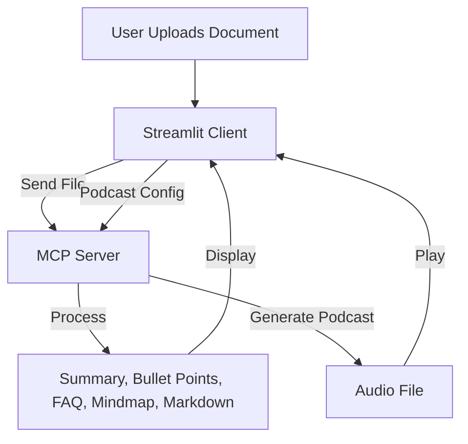

# Document Processing Pipeline

This document describes the end-to-end flow for document upload, processing, mindmap creation, and podcast generation in the BioReasoning system.

## 1. Document Upload & Initial Processing

**User Action:** Upload a document (PDF, DOCX, TXT, MD) via the Streamlit web interface.

**System Flow:**
1. The file is sent to the MCP server.
2. The server extracts:
   - Summary
   - Bullet points
   - FAQ (Q&A)
   - Mindmap (HTML)
   - Markdown content (for podcast)
3. Results are returned to the client and displayed in the UI.

**Example:**
- **Input:** `cancer_research.pdf`
- **Output:**
  - Summary: "This paper reviews recent advances in cancer immunotherapy..."
  - Bullet Points: "- Key finding 1\n- Key finding 2"
  - FAQ: "Q: What is immunotherapy?\nA: ..."
  - Mindmap: Interactive HTML visualization

## 2. Mindmap Generation

- Automatically triggered after document processing.
- Uses document structure and key concepts to build a mindmap.
- Returned as HTML and rendered in the Streamlit UI.

**Example:**
- **Input:** Processed document content
- **Output:** Mindmap HTML (displayed interactively)

## 3. Podcast Generation

**User Action:**
- Customize podcast options (style, tone, speakers, topics)
- Click "Generate In-Depth Conversation"

**System Flow:**
1. Client sends podcast config and document content to the MCP server.
2. Server generates a podcast audio file (MP3).
3. Audio is returned to the client and played in the browser.

**Example:**
- **Input:**
  - Markdown content from document
  - PodcastConfig: style="interview", tone="friendly", speakers=["host", "guest"]
- **Output:**
  - Audio file (MP3)

## Pipeline Diagram

## Error Handling & Feedback
- All errors are surfaced in the UI with clear messages.
- Users can re-upload, retry podcast generation, or clear results.

---

For architecture and troubleshooting, see [architecture.md](architecture.md) and [troubleshooting.md](troubleshooting.md). 